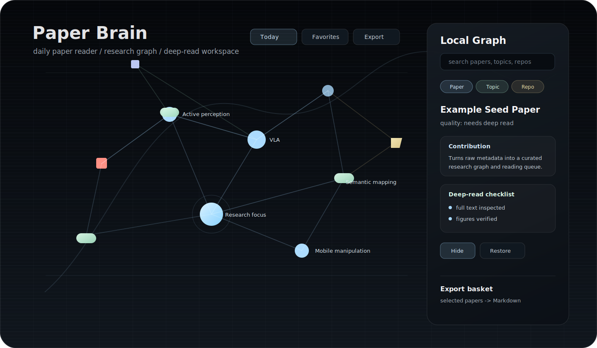

# Paper Brain

[English](README.md) | [简体中文](README.zh-CN.md)


Paper Brain 是一个本地优先的每日论文阅读器和研究知识图谱仪表盘。它可以帮助你发现论文和研究项目，根据研究画像做初筛，维护精读队列，并用交互式图谱查看一个领域的结构。

<p align="center">
  
</p>

## 为什么需要 Paper Brain

- 每次发现约 10 篇相关论文或项目；
- 优先关注顶会、强实验室和有代码支撑的工作；
- 区分自动导入的元数据和经过验证的精读结果；
- 把图像、笔记、图谱连接、收藏夹和导出汇总放在一个本地工作区；
- 让 Codex 这样的 AI 编程助手帮你跑每日流程。

## 功能

| 模块 | 能力 |
| --- | --- |
| 发现 | 支持 arXiv、Semantic Scholar、GitHub Search、基于 SerpAPI 的 Google Scholar，以及本地 PDF。 |
| 初筛 | 根据研究画像、boost terms、negative terms 和每日数量上限给条目打分。 |
| 精读 | 记录证据、验证图像、局限、机制、开放问题和与你项目的关系。 |
| 图谱 | 展示论文、主题、大领域、代码仓库、本地 PDF、收藏、隐藏节点和今日新增。 |
| 导出 | 将选中论文或所有今日新增论文导出为 Markdown 汇总。 |
| 双语 | 仪表盘和 README 都支持英文和中文。 |

## 快速开始

```bash
git clone https://github.com/KDafu/paper-brain.git
cd paper-brain
bash scripts/setup.sh
```

启动本地仪表盘：

```bash
source .venv/bin/activate
scripts/paper_brain/serve_paper_brain.sh 8765
```

打开：

```text
http://127.0.0.1:8765/doc/paper_brain/index.html
```

## 手动安装

```bash
python3 -m venv .venv
source .venv/bin/activate
python -m pip install --upgrade pip
python -m pip install -r requirements.txt
python scripts/paper_brain/paper_brain.py --offline
scripts/paper_brain/serve_paper_brain.sh 8765
```

## 每日流程

离线重建：

```bash
python scripts/paper_brain/paper_brain.py --offline
```

在 `config/paper_watch.json` 中启用在线来源后，运行在线发现：

```bash
python scripts/paper_brain/paper_brain.py
```

生成文件：

- `doc/daily_paper_digest/YYYY-MM-DD.md`
- `doc/paper_brain/graph.json`
- `doc/paper_brain/graph-data.js`
- `doc/paper_brain/deep_reading_queue.md`
- `doc/paper_brain/quality_audit.md`
- `doc/paper_brain/deep_reads/`
- `data/paper_brain/papers.sqlite` 本地缓存，已被 git 忽略

## 如何和 AI 助手协作

把 Paper Brain 安装到本地后，你可以让 Codex 这样的 AI 编程助手在仓库里帮你执行每日论文流程。

可以直接复制这些提示词：

```text
读取 config/paper_watch.json，运行今天的 Paper Brain 流程，总结最重要的论文。
从中选 3-5 篇做精读，并更新知识图谱。
```

```text
今天重点找强化学习和移动操作相关工作：
重停车、底盘-机械臂协同、抓取恢复、失败恢复。
生成每日摘要、精读队列和图谱更新。
```

```text
精读 doc/paper_brain/deep_reading_queue.md 中优先级最高的一篇论文。
使用全文证据，尽量验证关键图，笔记写入 doc/paper_brain/deep_reads/，
并更新 doc/paper_brain/deep_read_index.json。
```

推荐协作流程：

1. 让 AI 先检查 `config/paper_watch.json` 和你今天的研究目标。
2. 让它运行 `python scripts/paper_brain/paper_brain.py`。
3. 你查看 `doc/daily_paper_digest/YYYY-MM-DD.md` 和仪表盘。
4. 让 AI 只对 3-5 个高价值条目做精读。
5. 你确认后提交需要保留的笔记和图谱文件。

质量规则：自动导入摘要只是草稿。只有在全文、证据、图像、局限和项目相关性都被检查之后，才应把一个条目视为真正的精读结果。

## 配置研究画像

编辑：

```text
config/paper_watch.json
```

建议先改这些字段：

- `project_name`
- `project.label`
- `profile.core_topics`
- `profile.must_include_any`
- `profile.boost_terms`
- `profile.negative_terms`
- `sources.*.enabled`
- `graph.seed_papers`

默认配置会关闭在线来源，保证仓库克隆后可以直接运行。准备好之后再打开需要的来源。

## 在线来源

启用 arXiv：

```json
"arxiv": {
  "enabled": true
}
```

启用 GitHub 仓库发现：

```json
"github": {
  "enabled": true
}
```

如需更高的 GitHub 访问额度：

```bash
export GITHUB_TOKEN="..."
```

启用 Semantic Scholar：

```json
"semantic_scholar": {
  "enabled": true
}
```

可选：

```bash
export SEMANTIC_SCHOLAR_API_KEY="..."
```

通过 SerpAPI 启用 Google Scholar：

```json
"google_scholar": {
  "enabled": true
}
```

然后设置：

```bash
export SERPAPI_API_KEY="..."
```

项目不会直接爬取 Google Scholar。

## 仪表盘

通过本地服务打开 `doc/paper_brain/index.html`。

常用控件：

- 语言按钮：切换中文或英文；
- 搜索：查找论文、主题、方法和代码仓库；
- 今日新增：聚焦今天发现的条目；
- 收藏夹：过滤已收藏论文或项目；
- 局部图谱：查看当前节点附近的连接关系；
- 层级：在自动层级、大领域、主题和细节之间切换；
- 操作：隐藏选中节点，并从隐藏节点夹中恢复；
- 收藏面板：设置分类、移动收藏项、导出阅读汇总；
- 导出选中：导出手动加入导出篮的论文；
- 导出今日新增：直接导出今日新增的论文或项目；
- 清空导出篮：移除所有已加入导出的条目。

收藏、分类、隐藏节点、导出选择、语言和标题等浏览器状态保存在浏览器 `localStorage` 中。

## 精读

Paper Brain 会区分自动导入的元数据和真正的精读结果。

一个节点只有满足以下条件后，才应该被视为 `deep_read`：

- 已检查全文或项目文档；
- 已在 `doc/paper_brain/deep_reads/` 中写入精读笔记；
- 至少记录四条证据；
- 已验证关键图，或说明为什么无法获得关键图；
- 根据证据重写摘要、创新点、机制、相关性、局限和问题。

结构化精读元数据保存在：

```text
doc/paper_brain/deep_read_index.json
```

如果该文件存在，仪表盘会读取它。

## 本地 PDF

把 PDF 放在：

```text
papers/
```

然后启用：

```json
"local_pdf": {
  "enabled": true,
  "paths": ["papers"],
  "extract_text": true
}
```

如果系统安装了 `pdftotext`，文本会缓存到 `data/paper_brain/text/`。

默认关闭图像预览抽取。准备好存储生成的图像裁剪后，可以在 `graph.figure_preview` 下启用。

## 路线图

- 更完善的 arXiv、Semantic Scholar、GitHub 和 SerpAPI provider 插件。
- 更好的精读编辑器和质量校验 UI。
- 更安全的持久化图谱编辑导出和导入流程。
- 可选的全文向量搜索。
- 更好的图像抽取和人工图像验证。
- 支持多个研究项目画像。
